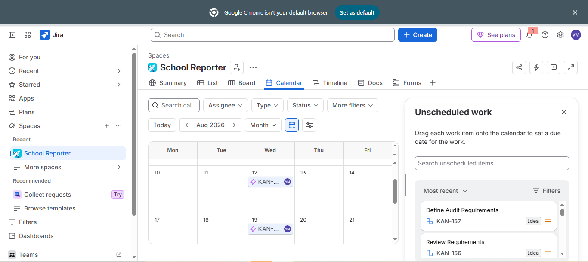
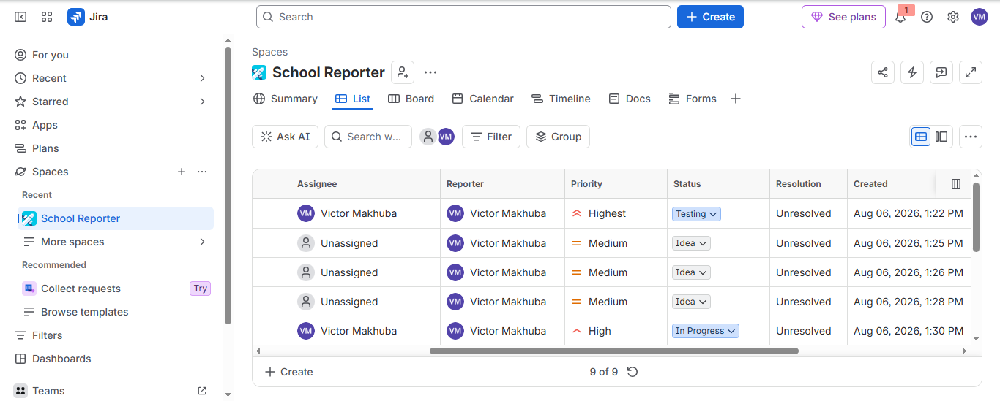

# Jira Project Management

## Overview

This Jira project demonstrates how the School Reporter system was planned and managed using Agile project management principles. The project was structured to reflect a typical Business Analyst workflow by breaking business requirements into Epics, Features and Tasks.

## Objectives

- Organise business requirements into manageable work items.
- Prioritise features based on business value.
- Track project progress through Jira.
- Demonstrate Agile planning and backlog management.

## Project Structure

### Epics

- User Access & Onboarding
- Learner & Class Management
- Attendance Management
- Homework Management
- Behaviour Management
- Parent Communication
- Reporting & Analytics
- School Administration
- Security & Compliance

### Features

Examples include:

- School Selection
- Teacher Login
- Capture Attendance
- Assign Homework
- Record Behaviour
- Parent Notifications

### Tasks

Each feature was broken down into business analysis activities such as:

- Gathering requirements
- Defining business rules
- Creating process diagrams
- Reviewing requirements

## Skills Demonstrated

- Jira Software
- Agile Project Management
- Backlog Management
- Requirements Management
- Feature Prioritisation
- Task Planning
- Business Analysis

## Screenshots

### Project Overview

### Board View

### Timeline

### Calendar

### Priorities, Status and Due Dates

