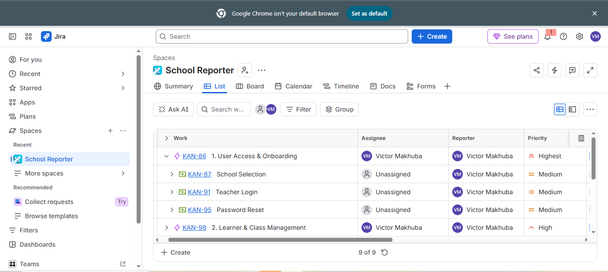
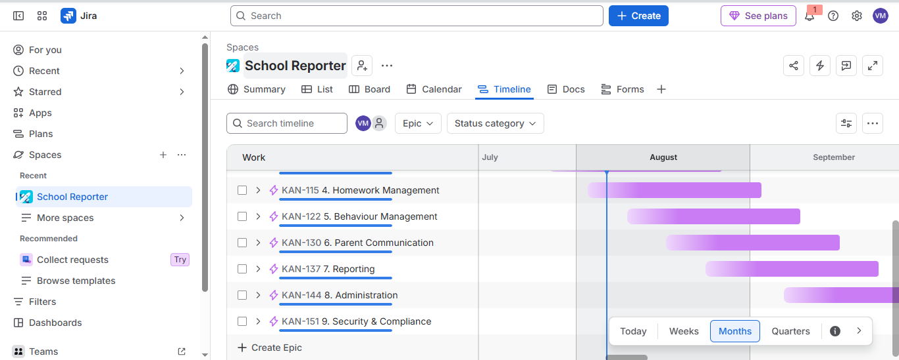
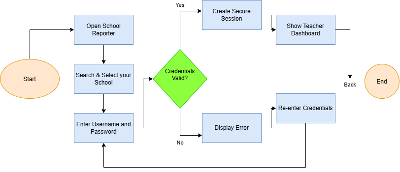
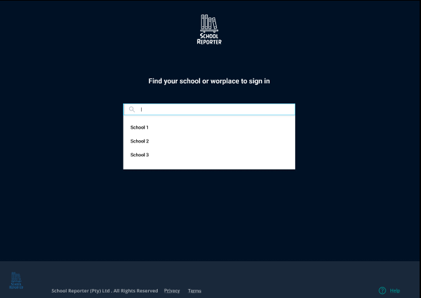
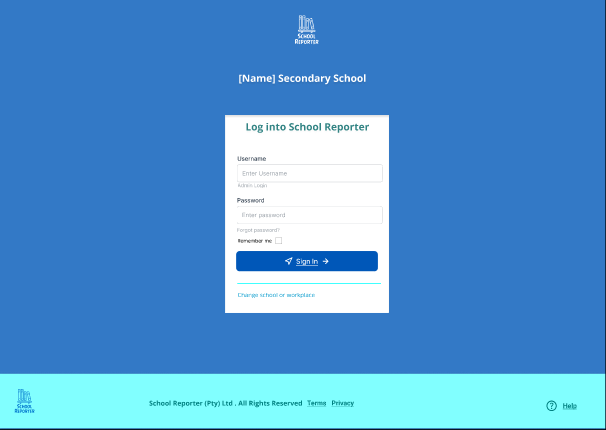
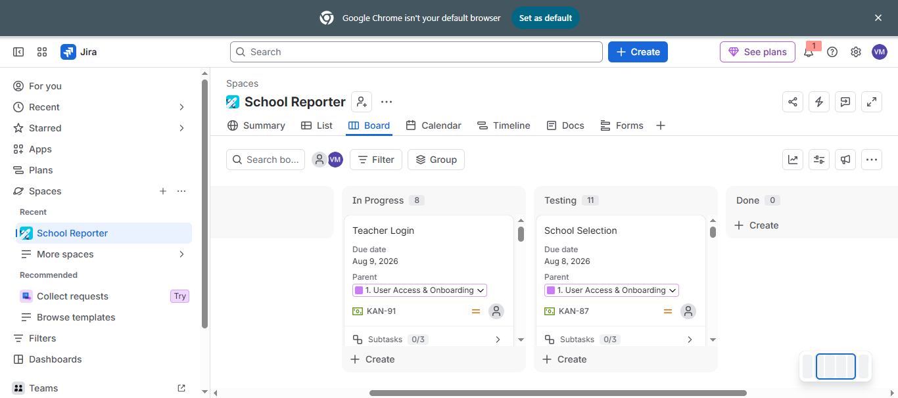

# 🎓 School Reporter – Business Analysis Portfolio

> **An end-to-end Business Analysis portfolio project demonstrating the Software Development Life Cycle (SDLC), Agile practices, requirements engineering, business process modelling, project planning and functional testing.**

---

## Portfolio Highlights

✔ End-to-End Business Analysis Project

✔ Agile Project Planning using Jira

✔ Business Process Modelling with Draw.io

✔ Requirements Documentation (BRD & SRS)

✔ User Stories with Acceptance Criteria

✔ Low-Fidelity Wireframes

✔ Functional Test Cases

✔ Requirements Traceability

---

# Project Preview

## Jira Board



---

## Project Timeline



---

## Teacher Login Process



---

## Table of Contents

- [Project Overview](#project-overview)
- [Repository Structure](#repository-structure)
- [Portfolio Artefacts](#portfolio-artefacts)
- [Tools Used](#tools-used)
- [Business Analysis Skills](#business-analysis-skills)
- [Future Improvements](#future-improvements)
- [About Me](#about-me)

---

# Project Overview

School Reporter is a Business Analysis portfolio project developed to demonstrate the complete Business Analysis lifecycle for a digital school management solution.

The project focuses on improving communication between schools and parents while streamlining school administration through requirements gathering, documentation, Agile planning, process modelling and solution design.

This repository contains the deliverables typically produced by a Business Analyst throughout a software development project.

---

# Business Objectives

- Improve communication between schools and parents
- Digitise manual administrative processes
- Reduce teacher administrative workload
- Improve learner record accuracy
- Improve operational efficiency
- Support informed decision-making
- Demonstrate practical Business Analysis skills

---

# Repository Structure

```text
School-Reporter-Business-Analysis-Portfolio
│
├── 01_Project_Charter
├── 02_Business_Case
├── 03_BRD
├── 04_SRS
├── 05_Process_Maps
├── 06_User_Stories
├── 07_Wireframes
├── 08_Jira
├── 09_Test_Cases
└── README.md
```

---

# Portfolio Artefacts

---

## 01 • Project Charter

Defines the project vision, objectives, stakeholders, scope, assumptions, constraints and success criteria.

**Skills**

- Project Initiation
- Scope Definition
- Stakeholder Analysis
- Project Planning

---

## 02 • Business Case

Demonstrates the business need, financial justification, estimated costs, expected benefits and ROI for the School Reporter solution.

**Skills**

- Business Analysis
- Cost–Benefit Analysis
- Business Justification
- Financial Evaluation

---

## 03 • Business Requirements Document (BRD)

Documents the high-level business requirements, stakeholder needs and project scope.

**Skills**

- Requirements Elicitation
- Requirements Analysis
- Business Documentation

---

## 04 • Software Requirements Specification (SRS)

Captures the functional and non-functional system requirements.

**Skills**

- Functional Requirements
- Non-Functional Requirements
- Requirements Documentation

---

## 05 • Process Maps

Business process diagrams created using Draw.io.

### Teacher Login Process


**Skills**

- Business Process Modelling
- Workflow Analysis
- Process Improvement

---

## 06 • User Stories

Agile user stories written using the standard format:

> As a...
>
> I want...
>
> So that...

Each user story includes acceptance criteria and supports traceability to business requirements and test cases.

---

## 07 • Wireframes

Low-fidelity wireframes illustrating the proposed user interface.

### Dashboard



### Teacher Login



**Skills**

- Wireframing
- UX Thinking
- Solution Design

---

## 08 • Jira

The project was planned using Jira following Agile principles.

### Jira Dashboard


### Board



### Timeline


### Calendar


**Skills**

- Agile
- Scrum
- Backlog Management
- Sprint Planning

---

## 09 • Test Cases

Functional test cases linked to user stories and business requirements.

The repository includes:

- Functional Test Cases
- Expected Results
- Pass/Fail Criteria
- Requirements Traceability Matrix

**Skills**

- Functional Testing
- Quality Assurance
- Test Planning
- Requirements Validation

---

# SDLC Lifecycle Demonstrated

```text
Business Case
        ↓
Project Charter
        ↓
Business Requirements (BRD)
        ↓
Software Requirements (SRS)
        ↓
User Stories
        ↓
Process Maps
        ↓
Wireframes
        ↓
Jira Planning
        ↓
Test Cases
```

---

# Tools Used

| Tool | Purpose |
|-------|---------|
| Jira | Agile Project Management |
| Draw.io | Process Mapping |
| Microsoft Word | Documentation |
| Git | Version Control |
| GitHub | Portfolio Hosting |

---

# Business Analysis Skills

- Business Analysis
- Requirements Gathering
- Stakeholder Analysis
- Requirements Documentation
- Business Process Modelling
- Agile Methodologies
- Scrum
- User Story Writing
- Acceptance Criteria
- Wireframing
- Functional Testing
- Requirements Traceability
- Project Documentation

---

# Future Improvements

Future versions of this project may include:

- Interactive prototype (Figma)
- BPMN 2.0 diagrams
- SQL database model
- REST API documentation
- Azure DevOps backlog
- User Acceptance Testing (UAT)
- Parent mobile application

---

# About Me

## Victor Makhuba

Aspiring Business Analyst with a passion for analysing business problems, improving processes and supporting software solution delivery through structured requirements analysis and Agile methodologies.

### Connect with me

**LinkedIn**

https://www.linkedin.com/in/victormakhuba/

**GitHub**

https://github.com/victormakhuba

---

## Thank you for visiting my portfolio.

If you have any feedback or opportunities, feel free to connect with me on LinkedIn.
